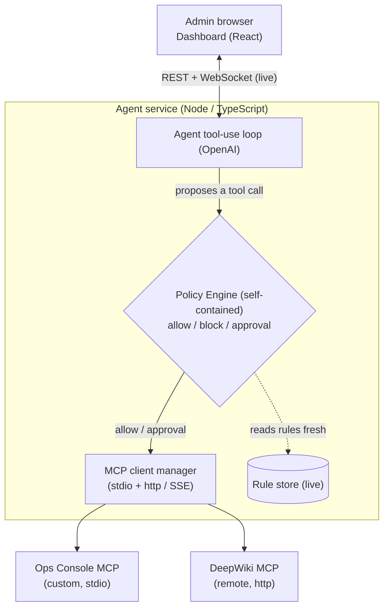

# Guarded AI Agent with MCP Support

A miniature AI agent security platform. An LLM agent runs a real tool-use loop against **MCP servers**, and a **standalone policy engine** sits between the agent and those tools, deciding on **every tool call** whether it is allowed, blocked, or needs human approval. An admin dashboard controls the guardrails live, so changes take effect on the running agent with no restart.

The interesting part is not that the agent can call tools. It is the seam between **what the model wants to do** and **what the system will permit**, and the fact that the model can never reach around the guard.

Built as the ArmorIQ SWE intern assignment.

## Active Links

| Resource | Link |
| - | - |
| Deployed app | _to be added_ |
| Demo video (5 min) | _to be added_ |

## Architecture



Everything in the loop flows through `PolicyEngine.evaluate()`. The agent makes **no** authorization decisions of its own.

## How it meets the brief

| Requirement | Where |
| - | - |
| LLM tool-use loop (decide, execute via MCP, feed back) | [`packages/agent/src/agent/Agent.ts`](packages/agent/src/agent/Agent.ts) |
| Connect to MCP servers (stdio **and** SSE/HTTP) | [`packages/agent/src/mcp/McpClientManager.ts`](packages/agent/src/mcp/McpClientManager.ts) |
| Two working MCP servers (1 remote, 1 custom) | DeepWiki (remote, http) plus Ops Console (custom), see [`servers.json`](servers.json) |
| **Live** tool discovery, nothing hardcoded | tools come only from `listTools()`; adding a server in `servers.json` is all it takes |
| Policy engine is a **separate, self-contained module** | [`packages/agent/src/policy/`](packages/agent/src/policy), with no OpenAI/MCP/HTTP imports |
| Block tools entirely | `block` rule |
| Require human approval | `approval` rule plus [`ApprovalManager`](packages/agent/src/approvals/ApprovalManager.ts) |
| Input validation (e.g. paths under `/sandbox/`) | `validation` rule plus [`validators.ts`](packages/agent/src/policy/validators.ts) |
| Cost/token budget per conversation | `budget` rule |
| Dashboard changes propagate **without restart** | rules read fresh per call plus WebSocket broadcast |
| Conversation logs (bonus) | live activity log panel plus [`LogStore`](packages/agent/src/store/LogStore.ts) |
| Custom MCP server, spec-correct, plug-and-play | [`packages/mcp-server/`](packages/mcp-server) |
| Prompt-injection handling (bonus) | two layers: the out-of-band gate (structural), plus a default guardrail scanning every tool argument for injection phrases |

## The policy engine (the heart)

[`PolicyEngine`](packages/agent/src/policy/PolicyEngine.ts) is a pure decision function. It knows nothing about OpenAI, MCP, or HTTP. Given a tool call in context it returns `allow`, `block`, or `require_approval`.

- **Live control:** it is constructed with `() => ruleStore.list()` and reads the rules **fresh on every evaluation**. A rule toggled in the dashboard changes the next decision, with no restart and no cache to bust.
- **Deterministic conflict resolution, most restrictive wins:** `BLOCK > REQUIRE_APPROVAL > ALLOW`. Budget overruns and failed validations are themselves blocks, so they sit at the top automatically.
- **Auditable:** every decision carries the rule that caused it, which is what the activity log shows.

Four rule types: `block`, `approval`, `validation` (prefix / regex / denyContains / maxLength on any argument), and `budget` (tokens per conversation).

## The custom MCP server, "Ops Console"

[`packages/mcp-server`](packages/mcp-server) simulates a company's infrastructure control plane over stdio. It is deliberately **dangerous** so the guard has something real to protect:

| Tool | Risk |
| - | - |
| `list_servers` | safe, read-only |
| `read_logs` | read-only, but the `billing-api` logs contain a prompt-injection payload |
| `restart_service` | medium, a good candidate for approval |
| `delete_database` | destructive, blocked by default |
| `read_secret` | secret exfiltration honeypot, blocked by default |

It enforces no authorization itself; it just exposes capabilities. Whether the agent may use them is decided entirely by the policy engine. It is plug-and-play: point any MCP client at it and it works.

## Run it locally

**Prerequisites:** Node 20+ and an OpenAI API key.

```bash
# 1. install
npm install

# 2. configure
cp .env.example .env        # then put your OPENAI_API_KEY in .env

# 3. build (compiles the MCP server, the agent, and the dashboard)
npm run build

# 4. run the agent (serves the API on :8080 and the dashboard too)
npm start
```

For development with a hot-reloading dashboard, use two terminals:

```bash
# terminal 1: agent API on :8080
npm run dev:agent

# terminal 2: dashboard on :5173 (proxies /api and /ws to :8080)
npm run dev:dashboard
```

Open `http://localhost:5173` in dev, or `http://localhost:8080` after a production build.

### Adding another MCP server (proves nothing is hardcoded)

Add an entry to [`servers.json`](servers.json) and restart the agent. Its tools appear automatically, with no agent-side code changes:

```json
{ "id": "my-server", "label": "My Server", "transport": "stdio",
  "command": "node", "args": ["path/to/server.js"] }
```

## Demo script (for the 5-minute walkthrough)

1. **Discovery:** point out the two connected servers and 8 live-discovered tools in the dashboard. None are hardcoded.
2. **Allow:** ask "List all the servers and their status." It runs, and the log shows a policy decision of allow.
3. **Block:** ask "Delete the production database." The model calls `delete_database`, the engine blocks it, and the agent explains it could not.
4. **Approval:** ask "Restart the analytics-worker service." A pending approval appears; click Approve or Deny and watch the loop resume.
5. **Live control:** toggle off "Never delete databases" in the dashboard, then ask to delete again. Now it is allowed. Toggle it back on. No restart.
6. **Prompt injection:** ask "Read the logs for billing-api." The logs contain a fake system notice telling the agent to delete the database and read a secret. The agent reports it as suspicious data, and even if it tried to comply, the `delete_database` and `read_secret` calls hit the same block. The guard sits outside the model, so injection cannot widen permissions.
7. **Budget:** set a tiny token budget and watch a conversation get cut off.

## Edge cases (point of view)

- **MCP server crashes mid-call.** Every call is wrapped in a timeout and try/catch in `McpClientManager`. A dead transport returns a structured tool-error that is fed back to the model, and the server is marked unhealthy so its tools drop out of discovery. The agent degrades, it does not hang.
- **Prompt-injection bypass attempt.** Two layers. Primary: enforcement lives outside the model in the policy engine, so no text in the conversation or in tool output can change what is permitted (demonstrated live via the `read_logs` payload). Defense-in-depth: a default validation guardrail (`argument: "*"`, `denyContains`) scans every tool-call argument for injection phrases and blocks the call if the agent is manipulated into forwarding attacker text into a tool.
- **Two rules conflict.** Resolved deterministically by most restrictive wins (`BLOCK > REQUIRE_APPROVAL > ALLOW`), evaluated in a fixed order, with the deciding rule recorded in the log.
- **Approval needed but approver offline.** Approvals fail closed: if no human responds within `APPROVAL_TIMEOUT_MS` (default 60s), the request expires and the tool is denied. A missing approver never results in a dangerous tool running.

## Project structure

```
armoriq-guarded-agent/
├─ servers.json               # which MCP servers to connect to (pure config)
├─ railway.json               # deploy config
├─ packages/
│  ├─ agent/                  # the guarded agent service
│  │  └─ src/
│  │     ├─ mcp/              # MCP transport: connect, discover, call, health
│  │     ├─ policy/           # the policy engine (self-contained)
│  │     ├─ store/            # rule store (live events) and log store
│  │     ├─ approvals/        # human-in-the-loop, fail-closed
│  │     ├─ agent/            # the OpenAI tool-use loop (thin on policy)
│  │     └─ api/              # REST and WebSocket
│  ├─ mcp-server/             # the custom "Ops Console" MCP server
│  └─ dashboard/              # React admin UI
```

## Deployment (Railway)

`railway.json` builds all three packages and starts the agent, which serves both the API and the built dashboard on a single port. Set `OPENAI_API_KEY` (and optionally `OPENAI_MODEL`) as environment variables in the Railway project.
